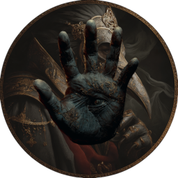
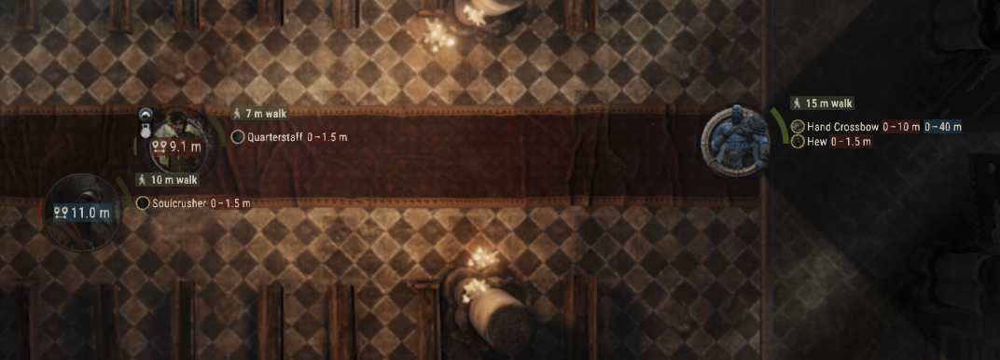

# Maleficar Manoeuvres

A movement and positioning system for Foundry VTT that enhances tactical gameplay with collision detection, snapping, and visual feedback. 

To follow the module’s development, you can read the series here: https://hashnode.stonedtroll.com/series/maleficar-manoeuvres

## Here Be Dragons

“I endeavoured to turn the ocean to steam by my will alone—only to find its waves dragging me down into oblivion.”

- Only compatible with gridless scenes.
- Limited testing performed.
- Slightly over-engineered.
- Cartful of technical debt. Features > technical debt repayment

## Features

### Movement System
- **Collision Detection**: 3D collision detection.
    - Accommodates tokens marked as non‑blocking (like swarms).
- **Snap-to-Position**: Positioning that snaps tokens to valid locations when movement is blocked.
- **Elevation Support**: 3D movement with height-based collision detection.
- **Respects Disposition**:
    - Allows movement through tokens of the same or neutral disposition.
    - Never permits a token to end its move overlapping another token, regardless of disposition.
- **Unconstrained Movement**: When the unconstrained movement toggle is active, tokens may move through and occupy spaces containing obstacles, ignoring normal collision checks.

### Visual Feedback
- **Facing Arcs**: Display token facing direction and field of view.
- **Token Boundaries**: Visual representation of token collision boundaries.
- **Obstacle Indicator**: While dragging, highlight the first token that would obstruct movement in real time.

    

- **Actor Info**: Displays each actor’s movement speed, providing at‑a‑glance speed information during play.
    - Highlight label indicating active movement mode
    - Displays the effective and total range of the actor’s currently equipped weapon.
        - The effective range is highlighted in crimson for quick recognition.
        - If the effective and total ranges are identical, only the effective range is shown.
        - Supported: D&D 5E
        - Future Support: Additional game systems will be added based on community interest.
- **Rangefinder**: Dynamically display 3D, edge‑to‑edge distances using spatial volume between selected tokens and other tokens on the canvas, updating in real time to help players gauge movement, weapon and spell ranges.
    - Visually distinguishes when a token falls within the source token weapon’s effective range or overall range.

    

  
When a token is being dragged, its boundary is attached to the preview token.

### Configuration
- **Token Height**: Can now be set per‑token or globally in the module settings. If a token’s height is left blank, the default value is used with multipliers based on creature size and type. This height is factored into rangefinding, cover determination, and collision detection.
- **Keybinding**: The Toggle Overlay action now uses Foundry’s keybinding system.
- **Melee Weapon Range Override**: Overrides a weapon’s default range when it exactly equals the grid scale distance. Since distance is measured edge‑to‑edge, set this to 0 to require tokens to touch for melee attacks.

## Usage
- Hold 'm' to display token boundaries and facing arcs.
- The facing-arc colour indicates each token’s disposition.
- Selecting a token changes its facing-arc to your user colour.
- By default, selection and hover borders are turned off, but you can enable them again in the Settings menu.

## Suggested Module
- Enhances token vision detection and assists in identifying which tokens should display an overlay: https://github.com/dev7355608/vision-5e

## Attribution
<ul>
    <li><a href="https://www.flaticon.com/free-icons/movement" title="movement icons">Movement icons created by Bogdan Rosu - Flaticon</a></li>
    <li><a href="https://www.flaticon.com/free-icons/eagle" title="eagle icons">Eagle icons created by Puckung - Flaticon</a></li>
    <li><a href="https://www.flaticon.com/free-icons/swimming-pool" title="swimming pool icons">Swimming pool icons created by RA_IC0N21 - Flaticon</a></li>
    <li><a href="https://www.flaticon.com/free-icons/climbing" title="climbing icons">Climbing icons created by Freepik - Flaticon</a></li>
    <li><a href="https://www.flaticon.com/free-icons/dig" title="dig icons">Dig icons created by Leremy - Flaticon</a></li>
    <li><a href="https://www.flaticon.com/free-icons/road" title="road icons">Road icons created by Pixel perfect - Flaticon</a></li>
</ul>

    &nbsp;&nbsp;&nbsp;&nbsp;&nbsp;

